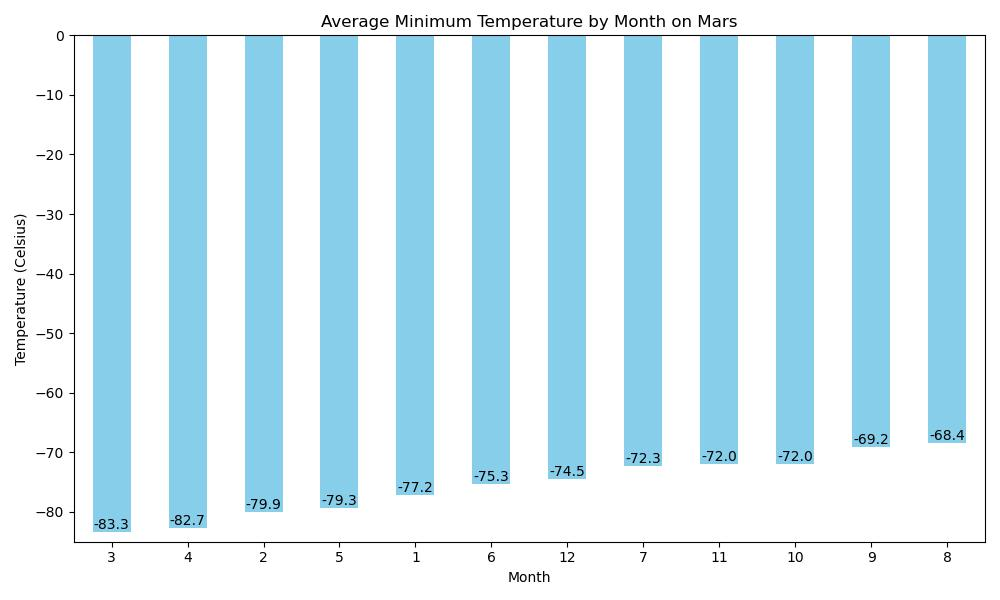
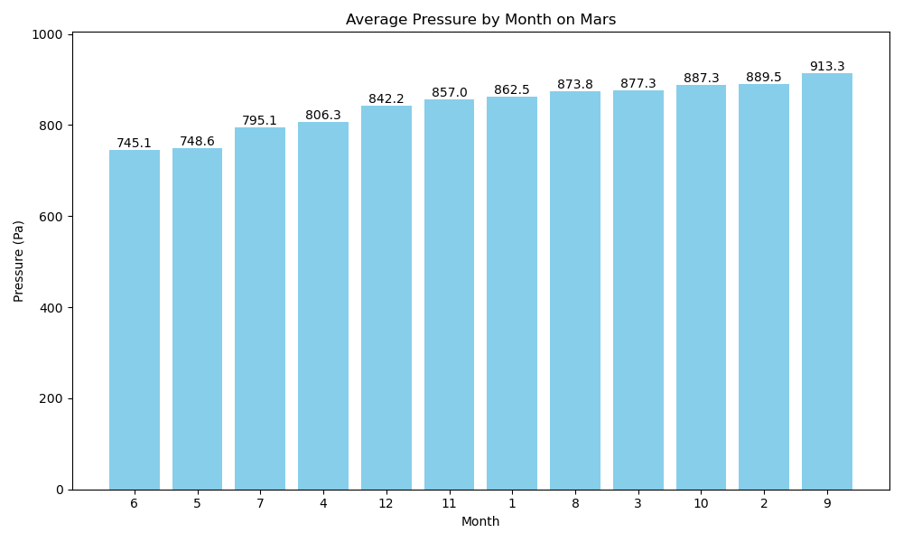
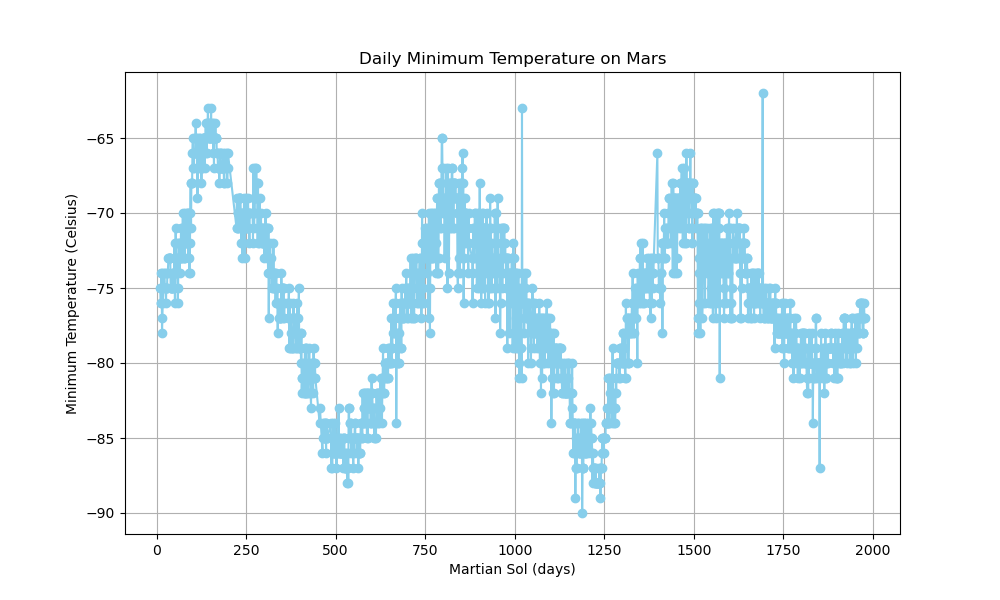

  

# Mars Data Analysis Project

## Overview
This project involves web scraping and data analysis of Mars-related information. It consists of two main parts:
1. Scraping titles and preview text from Mars news articles
2. Scraping and analyzing Mars weather data

## Part 1: Mars News Scraping

In this section, I used automated browsing with Splinter and HTML parsing with Beautiful Soup to scrape titles and preview text from Mars news articles.

### Process
1. Visited the Mars news site ("https://static.bc-edx.com/data/web/mars_facts/temperature.html")
2. Created a Beautiful Soup object to parse the HTML
3. Extracted all text elements from the site
4. Stored each title and preview pair in a Python dictionary
5. Collected all dictionaries into a Python list
6. Exported the scraped data to a JSON file for easy sharing

## Part 2: Mars Weather Data Analysis

This part involved scraping and analyzing Mars weather data, which was presented in a table format.

### Process
1. Used automated browsing to visit the Mars Temperature Data Site
2. Created a Beautiful Soup object to scrape the data in the HTML table
3. Assembled the scraped data into a Pandas DataFrame
4. Examined and converted data types as necessary
5. Analyzed the dataset to answer specific questions:

   - Number of months on Mars
   - Number of Martian days' worth of data
   - Coldest and warmest months on Mars (average daily minimum temperature)
   - Months with lowest and highest atmospheric pressure
   - Approximate number of terrestrial days in a Martian year

### Visualizations

I created several visualizations to support the analysis:

1. **Average Minimum Daily Temperature by Month**: A bar chart showing the average minimum daily temperature for each month on Mars. This visualization clearly illustrates that the third month is the coldest, while the eighth month is the warmest.

  

2. **Average Daily Atmospheric Pressure by Month**: Another bar chart displaying the average daily atmospheric pressure for each Martian month. This plot reveals that the sixth month has the lowest atmospheric pressure, while the ninth month has the highest.

  

3. **Daily Minimum Temperature Over Time**: A line plot of the daily minimum temperature throughout the dataset. This visualization was used to estimate the number of terrestrial days in a Martian year by identifying the cyclical pattern in temperature data.

  

### Key Findings

- Mars has 12 months.
- The dataset contains 1867 Martian days' worth of data.
- The third month is the coldest, and the eighth month is the warmest on Mars.
- Atmospheric pressure is lowest in the sixth month and highest in the ninth.
- A Martian year is approximately 675 Earth days, which is close to the actual value of 687 Earth days.

## Dependencies

To run this analysis, you'll need the following Python libraries:
- Splinter
- Beautiful Soup
- Pandas
- Matplotlib
- NumPy
- SciPy

## Conclusion

This project demonstrates the power of web scraping and data analysis techniques in extracting meaningful insights from Mars-related data. The findings provide interesting information about the Martian climate and its yearly cycles, which could be valuable for future Mars exploration missions.